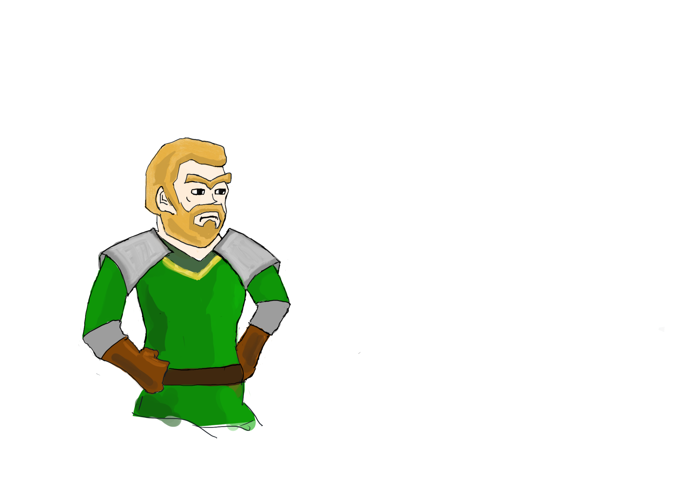
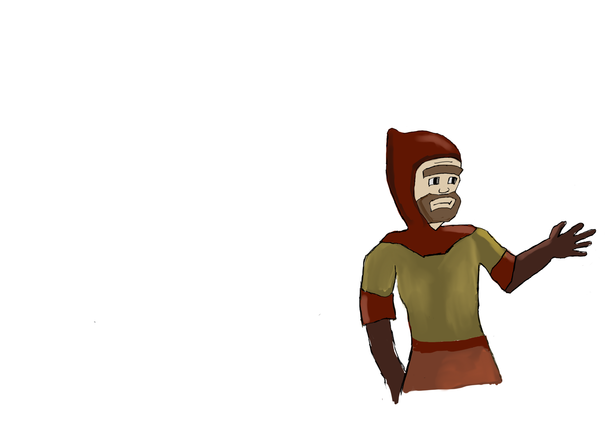
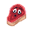
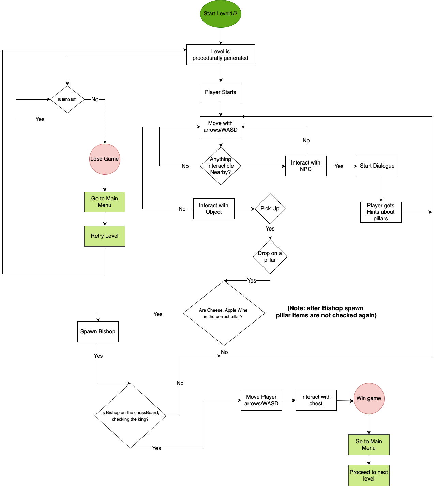
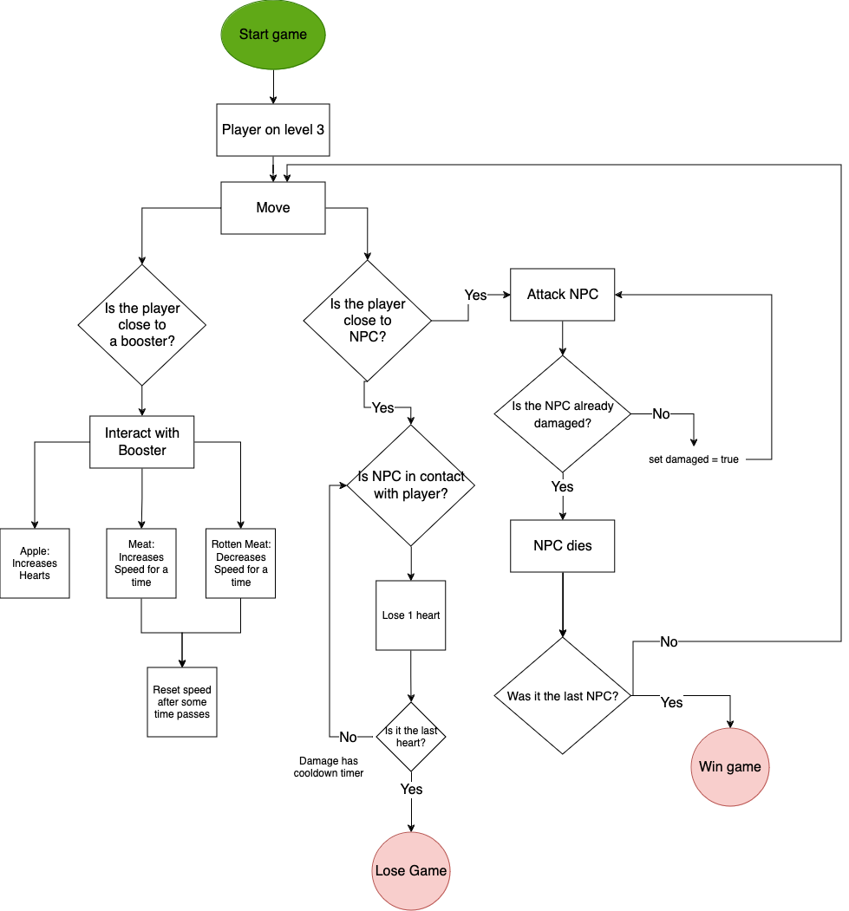

# 3d Puzzle Adventure Game

## Project Overview

This is a Graphics TUC course project by Ioannis Christofilogiannis. The project is a puzzle adventure game developed in Unity, featuring multiple levels with different gameplay mechanics.

## Download

## Screenshots

*The title screen*

*The snow level*

*The chessboard battle level*

## Game Art

*The hero*

*The helpful (?) NPC*

*A heart/life booster sprite*

*A meat booster sprite*

## Game Description

### Levels 1-2

- **Playable Character**: A goofy hero searching for the script of light (or perhaps just a random person posing as a hero for profit).
- **Setting**: A fantasy remote village that changes on every run. The game showcases two seasons: Spring (Level 1) and Winter (Level 2).
- **Objective**: Fulfill the requests given by the NPC to obtain the desired item.

### Level 3

- **Playable Character**: The same hero, now in a challenging situation.
- **Setting**: A chessboard where the hero must fight chess pieces to escape.
- **Objective**: Defeat all chess pieces while using boosters to survive and avoid hazards.

## Key Features

- Procedurally generated game elements
- Dynamic dialogue system
- Character animations
- Multiple game mechanics across levels
- Boosters and hazards in Level 3

## Game Flowcharts

*Levels 1,2*

*Level 3*

## Scripts Overview

### Levels 1-2

| Script Name | Functionality |
|-------------|---------------|
| AudioManager | Controls SFX playback |
| CameraFollowPlayer | Manages camera movement and perspective |
| DialogueManager | Handles dialogue flow and processing |
| GameInput | Manages keyboard input |
| GameManager | Checks win/lose conditions and game state |
| GameObjectPickable | Defines pickable object behavior |
| IObjectOwner | Interface for object ownership |
| NPCInteract | Manages NPC dialogue and player tracking |
| ObjectOwnerPillar | Implements object ownership for pillars |
| Player | Controls main character actions |
| PlayerAnimationController | Manages player animations |
| ObjectSpawner | Procedurally spawns game elements |
| TreasureChestOpen | Handles final chest animation |
| UIManager | Controls UI elements visibility and functionality |
| DialogueElement | Defines dialogue chunk structure |
| DialogueData | Manages dialogue progression |

### Level 3

| Script Name | Functionality |
|-------------|---------------|
| AudioManager | Controls SFX playback |
| BadMeat | Implements speed debuff mechanic |
| Heart | Implements health restoration mechanic |
| Meat | Implements speed boost mechanic |
| CameraFollowPlayer | Manages camera movement and perspective |
| GameInput | Manages keyboard input |
| GameManager | Checks win/lose conditions |
| HealthBarManager | Updates UI for player health and boosts |
| NPC | Controls enemy behavior and patrols |
| Player | Controls main character actions |
| PlayerAnimationController | Manages player animations |
| UIManager | Handles UI elements like pause and game over screens |

### Main Menu

| Script Name | Functionality |
|-------------|---------------|
| MainMenu | Controls scene loading and app exit |

## Game Elements

### Levels 1-2

- Playable Character
- NPC
- Pickable Objects
- Pillars & Chessboard

### Level 3

- Playable Character
- NPCs (Chess Pieces)
- Boosters (Apples, Meat)
- Hazards (Rotten Meat)

## Art and Assets

- Character portraits drawn using Procreate
- Sprites created using Pixaki 3 on iPad
- Custom-made terrains, scenes, ground materials, and UI elements

## Credits

### Asset Store Assets

- Character 3D models and environments: [Adventure Pack - Synty POLYGON](https://assetstore.unity.com/packages/3d/environments/fantasy/adventure-pack-synty-polygon-stylized-low-poly-art-80585)
- Pixel Fonts: [Asset Store Link](https://assetstore.unity.com/packages/2d/fonts/pixel-fonts-113588)
- Chess Set: [Asset Store Link](https://assetstore.unity.com/packages/3d/props/chess-set-38661)
- Skyboxes: [FREE Skybox Extended Shader](https://assetstore.unity.com/packages/vfx/shaders/free-skybox-extended-shader-107400)
- Additional inspiration: [LowPoly Environment - Nature Free](https://assetstore.unity.com/packages/3d/environments/lowpoly-environment-nature-free-medieval-fantasy-series-187052)
- UI element from Codemonkey's KitchenProject

### Custom Assets

- Dialogues
- 2 Materials for ground
- 2D portraits (Procreate)
- Heart and Meat Sprites (Pixaki)
- Audio mixing (Audacity)

### Music and SFX

- Level 1: "Nona" by Biiansu mixed with wales birdsong by DraperSFX
- Level 2: "November Snow" by cynicmusic
- Main Menu: "The Adventure Begins" by bart
- SFX: Various sources (Pixabay, UNIVERSFIELD)

### Animations

- StandardWalk, Idle, Looking animations from Mixamo

## Tutorials and Learning Resources

- Codemonkey's C# and Unity tutorials
- Udemy course: Complete C# Unity Game Developer 3D
- Various YouTube tutorials on specific Unity features

## Installation and Setup

- Download the complete folder from Google Drive and run the .exe file in a Windows machine

## Future Improvements

- Improve level3 enemy attacks, animations, collisions
- Add dialogues to level3
- Have resolution options, scaling (Now limited to 1080p)

## Contact

